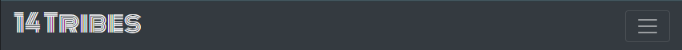
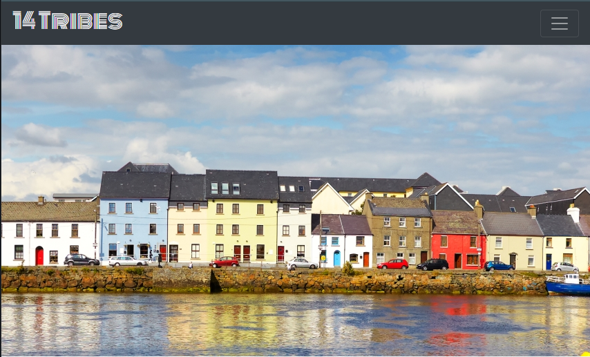
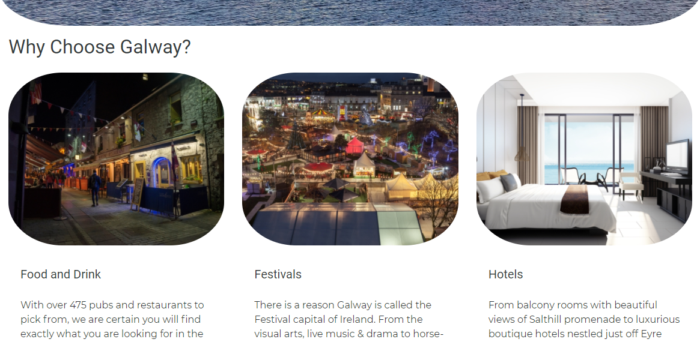
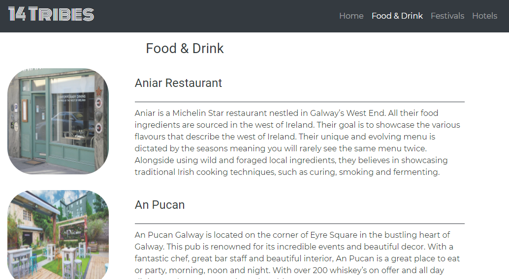

# 14 TRIBES WEBSITE

The 14 TRIBES Website was designed to promote Galway City as a suitable location for holiday makers. This website is intended to target groups and couples looking to arrange a short break. This is achieved by providing information on restaurants, hotels and festivals that may be of interest to the user.

[View the live project here.](https://gwgjnr.github.io/Fourteen_Tribes/index.html)

## Features

### Current Features

**Navigation Bar**

- The responsive nav bar was created using a bootstrap template. This is identically displayed across all four pages and includes the website logo on the lefthand side with the page menu floating left to allow navigation of the site. 

- Having initially created a nav bar without bootstrap, I found that once it reached the smaller screen sizes it was not visually pleasing and decided to use bootstrap as this allows for a collapsable menu which is hidden until clicked on small screens.

- I included the active class on each page when you visit it so it highlights the page you are currently viewing in the nav bar.

**Homepage Image**

- This image was selected to give the user a view of a famous part of Galway called The Long Walk with the aim of furthering enticing the customer with the scenery.

**Homepage Main Body**

- This section was designed using the cards class from Bootstrap. This allowed me to keep the page layout responsive across all screen sizes. I included an image in each card to further promote Galway.

- The text for each section is aiming to include as much information as possible to describe the range of options, currently including restaurants, festivals and hotels available in Galway and further encourage the user to research more.

- I included a find out more button with an inviting green colour as a call to action to allow the user to easily navigate from the Homepage Main Body to the particular page which attracted their attention the most.

- From using the card class in Bootstrap, I can easily add further sections to continue to grow the types of attractions available in galway eg. Family activites.

**Footer**

- The footer for this website is designed to match the color scheme of the nav bar with the same dark grey to inform the customer that they have reached the bottom of the page.

- The footer includes links to all major social media as this allows the customer to navigate easily to the relevant social media page which encourages them to share and generate further exposure.

**Secondary Pages**

- These pages were built to provide further information on each type of attraction currently displayed on the homepage, should the user be interested. These pages can be accessed from both the nav bar and buttons in the main body to allow easy navigation of the site. 

- Restaurants, festivals and hotels each have their own page which provides a range of options, brief summary and displays a related image. The image and paragraphs are positioned using Bootstrap column system which allowed me to ensure they are responsive across all screen sizes.

### Future Features

- I believe the page would be a great opportunity for local businesses in the tourism industry to partake in targeted advertising for special offers they are making. This could be implemented by adding advertising bars near the top of each secondary page which would create a source of revenue.

## Technologies used

### Languages used

1. HTML
2. CSS

### Frameworks used

1. Bootstrap 4.1.3
* Bootstrap was used to ensure the pages are responsive across all screen sizes. 

2. Google Fonts
* Google Fonts was used to provide the font styling for the logo, headers and paragraphs.

3. Font Awesome
* Font Awesome was used to create anchored social media icons in the footer. 

4. jQuery
* jQuery was needed with Bootstrap to make the nav bar responsive.

5. Git
* Git was used for version control by utilizing the Gitpod terminal to commit to Git and Push to GitHub.

6. Github
* Github was used to store the website by using the to commit to Git and Push to GitHub.

7. http://www.imageoptimizer.net/
* This website was used to optimize larger images to ensure loading times were kept to a minimum.

## Testing

The W3C Markup Validator and W3C CSS Validator Services were used to validate every page of the project to ensure there were no syntax errors in the project.

- Please see [here](assets/images/htmlcheck.PNG) for HTML Validator.

- Please see [here](assets/images/csscheck.PNG) for CSS Validator.

Throughout the creation of this site, I found that the most issues arised when scaling the site to smaller screen sizes. I encountered issues like this [example](assets/images/ms1_issue1.PNG) where the imagery would overlap on the headings. After speaking with a peer, I decided to make use of bootstrap's columns system to ensure the imagary and text did not cross over.

I found that the text crossed over the image on the secondary pages, please see [example](assets/images/ms1_issue2.PNG) here which only occurred between 970px - 1140px. I rectifed this issue by changing the width rule for the article_images from a set rem to a percentage which allowed the image to scale in it's column.

## Deployment

You can follow the steps below to deploy the project to GitHub.

  1. In the GitHub repository, navigate to the Settings tab 
  2. From the source section drop-down menu, select the Master Branch
  3. Once the master branch has been selected, the page will be automatically refreshed with a detailed ribbon display to indicate the successful deployment. 

The deployed link can be found [here.](https://gwgjnr.github.io/Fourteen_Tribes/index.html)

## Credits

### Content

- The navbar was initially built using the Run Loving mini-project as a template for the code layout, which can be seen in the initial commits. Having then tested this on smaller screen sizes and discussing the sizing issues encountered with a friend, I decided to make use of Bootstraps template for a navbar, which allows it to be collapsed.

- I made use of https://www.w3schools.com/ for the css rules to make the website logo slide in from the left. 

- I used bootstrap to allow me to divide the the body of each page into rows and columns which ensured the display was responsive across all screen sizes. 

- The icons in the footer were taken from [Font Awesome](https://fontawesome.com/) and the design of the footer was based off the design shown the Love Running Project but eventually changed to include a row and columns to allow the icons to respond better to smaller screen sizes.

- The text throughout the site was written by the developer. The information was collected from Wikipedia and websites related to each event.

### Media

- All images on the homepage and festival page were taken from https://www.shutterstock.com/home

- Images for the food page were sourced from each original restaurant's website galleries. 
   - Aniar source: https://en.wikipedia.org/wiki/Aniar
   - An Pucan source: https://anpucan.ie/gallery-2/
   - John Keoghs source: https://www.johnkeoghs.ie/john-keoghs-gastropub-gallery/

- Images for each of the hotels were sourced from the original hotel's website.
   - The House hotel: https://www.thehousehotel.ie/home/hotel-gallery/
   - The Galway Bay hotel: https://www.galwaybayhotel.net/gallery
   - The G Hotel: https://www.theghotel.ie/hotel-photos/

